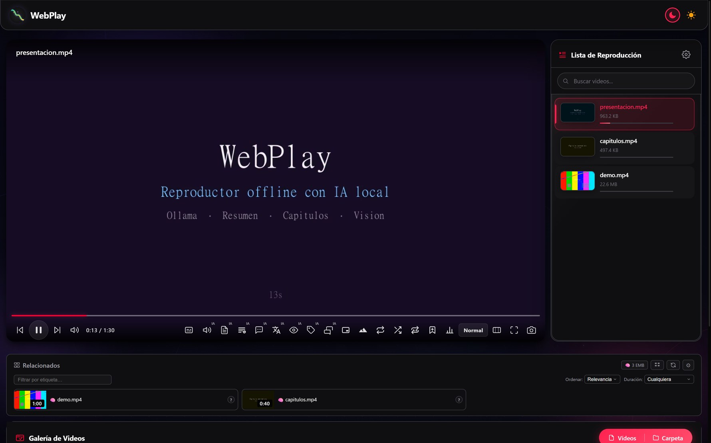
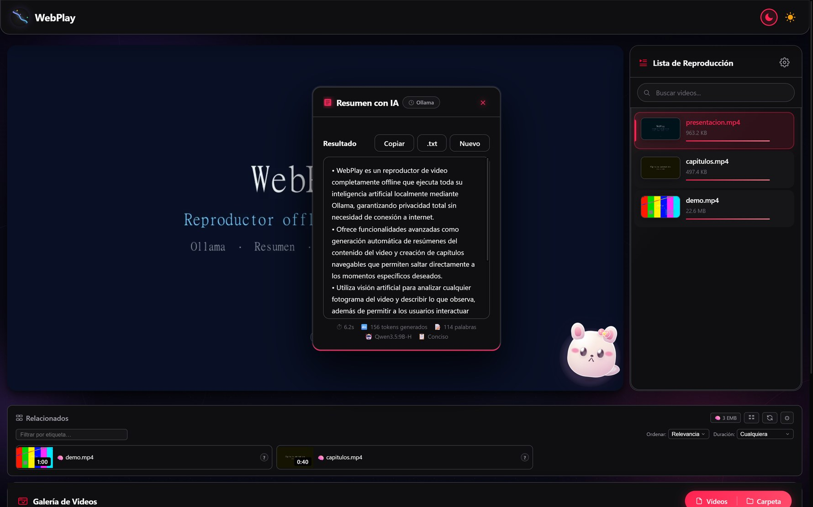
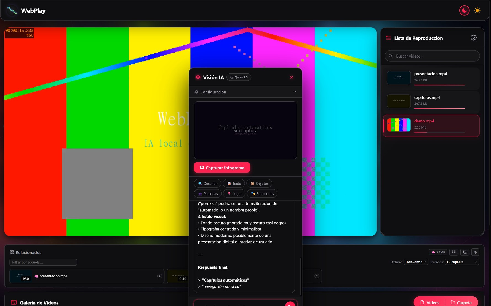

<div align="center">

<h1>🎬 WebPlay</h1>

<h3>Reproductor de video offline con inteligencia artificial local</h3>

<p><strong>Tu vídeo no sale nunca de tu ordenador. Tampoco la IA.</strong></p>



<sub>WebPlay en acción · tema oscuro · Ollama ejecutando el modelo en local</sub>

</div>

---

## ¿Qué es?

WebPlay es un reproductor de vídeo que se ejecuta **íntegramente en tu máquina** y que usa un
modelo de lenguaje local ([Ollama](https://ollama.com)) para entender lo que estás viendo:
genera resúmenes, crea capítulos navegables, responde preguntas sobre el vídeo, describe
fotogramas, traduce subtítulos y narra el contenido mientras lo reproduces.

No hay cuenta, no hay nube, no hay telemetría. Es HTML, CSS y JavaScript servidos por un
servidor local escrito en PowerShell.

> **Idioma de la interfaz:** español · **Modelos:** los que tengas instalados en Ollama

---

## ✨ Funciones

<table>
<tr><td width="50%">

**▶️ Reproducción**
- Velocidad de `0.25×` a `2×`, repetición **A-B**, loop y aleatorio
- Barra de progreso con **miniatura al pasar el ratón** y marcadores de capítulo
- **Picture-in-Picture**, pantalla completa, **modo cine** y captura de fotograma a PNG
- **Temporizador de sueño** (hasta 8 h) y reanudación automática por vídeo
- Miniaturas generadas del propio fotograma y galería **virtualizada** (500–2000 vídeos)
- Búsqueda con `Ctrl/⌘ + K`: *fuzzy* con Levenshtein y tolerante a errores
- Fondo galáctico con parallax y halo de color que sigue al vídeo
- Temas **oscuro** y **claro**, color de acento personalizable

**💬 Subtítulos**
- Carga `.srt`, `.vtt`, `.ass`, `.ssa`, `.sub`, `.lrc` y detecta codificación (UTF-8/16, latin-1)
- Empareja el `.srt` hermano automáticamente e indexa carpetas
- Ajuste de **desfase** manual y exportación a `.srt` / `.vtt`
- Cola de procesado con reintentos y **caché LRU**
- Búsqueda en **OpenSubtitles** con descarga directa (opcional, requiere API key)

</td><td width="50%">

**🤖 Inteligencia artificial (Ollama)**
- **Resumen con IA** — conciso, detallado, viñetas, párrafo o actas
- **Capítulos IA** — navegables y aplicables a la barra de progreso
- **Chat IA** — con **RAG** de 5 etapas (exacto → fuzzy → BM25 → embeddings → LLM)
  y marcas de tiempo clicables que saltan al vídeo
- **Visión IA** — describe, lee texto (OCR), detecta objetos, personas, lugar y emociones
- **Traducción de subtítulos** — 11 idiomas de destino, con vista tabla y aplicar en caliente
- **Comentarios en tiempo real** — 8 estilos de narración durante la reproducción
- **Etiquetar con IA** — etiquetas semánticas automáticas para toda la biblioteca
- **Recomendaciones** — ordenadas por relevancia semántica con embeddings

**🐾 Mochi-IA, tu mascota**
- Tres modos: **macho**, **hembra** o apagada
- 13 estados propios: leyendo, pensando, hablando, durmiendo, curiosa, celebrando…
- Reacciona a la reproducción: saluda, se aburre si no hay actividad, se despide al acabar
- Personalidades: dulce-curiosa, traviesa, mimosa, chispita
- **Voz offline real** (sintetizador WASM embebido, sin descargar nada)

</td></tr>
</table>

---

## 📸 Así se ve

### Resumen con IA

Genera un resumen del vídeo a partir de los subtítulos y muestra las métricas reales de la
ejecución: tiempo, tokens, palabras, modelo y estilo usado.



<sub>Resumen generado por <code>Qwen3.5:9B-H</code> en local · 6.2 s · 156 tokens · 114 palabras</sub>

### Visión IA

Captura el fotograma que quieras y analízalo: descripción detallada, extracción de texto
(OCR), objetos, personas, lugar y emociones.



<sub>Análisis visual de un fotograma — modelo con capacidad <code>vision</code> ejecutándose en local</sub>

---

## 🚀 Instalación

### Requisitos

| | |
|---|---|
| **Sistema** | Windows con PowerShell 5.1 o superior *(probado en Windows 11)* |
| **Navegador** | Chrome o Edge *(Chromium recomendado)* |
| **IA** | [Ollama](https://ollama.com) instalado y en ejecución |
| **Hardware** | 8 GB de VRAM recomendado para un modelo de 9B en cuantización Q4 |

> No necesitas Python, Node.js, ni instalar nada más. No hay `npm install`.

### 1. Instala Ollama y los modelos

Descarga Ollama desde [ollama.com](https://ollama.com). WebPlay necesita **tres modelos**,
que se instalan desde Hugging Face en formato GGUF y se cargan en Ollama.

<table>
<tr><th width="26%">Función</th><th width="30%">Archivo</th><th>Repositorio</th></tr>
<tr>
<td><strong>Texto + visión</strong><br><sub>resumen, capítulos, chat, visión, traducción</sub></td>
<td><code>Qwen3.5-9B-Claude-4.6-HighIQ-INSTRUCT-HERETIC-UNCENSORED.Q4_K_M.gguf</code></td>
<td><a href="https://huggingface.co/mradermacher/Qwen3.5-9B-Claude-4.6-HighIQ-INSTRUCT-HERETIC-UNCENSORED-GGUF">mradermacher/…-GGUF</a><br><sub>base: <a href="https://huggingface.co/DavidAU/Qwen3.5-9B-Claude-4.6-HighIQ-INSTRUCT-HERETIC-UNCENSORED">DavidAU/…</a></sub></td>
</tr>
<tr>
<td><strong>Visión</strong><br><sub>proyector para imágenes</sub></td>
<td><code>…-UNCENSORED.mmproj-Q8_0.gguf</code></td>
<td><a href="https://huggingface.co/mradermacher/Qwen3.5-9B-Claude-4.6-HighIQ-INSTRUCT-HERETIC-UNCENSORED-GGUF">mradermacher/…-GGUF</a></td>
</tr>
<tr>
<td><strong>Embeddings</strong><br><sub>RAG del chat y recomendaciones</sub></td>
<td><code>nomic-embed-text-v2-moe.Q8_0.gguf</code></td>
<td><a href="https://huggingface.co/nomic-ai/nomic-embed-text-v2-moe-GGUF">nomic-ai/…-GGUF</a></td>
</tr>
</table>

#### Instalación asistida: doble clic y listo

El repo trae dos carpetas con todo preparado. **No hace falta escribir ni una línea de
comandos**: copia los `.gguf` en su sitio y doble clic en el instalador.

```
_Qwen3.5-9B/                              ← texto + visión  (~6 GB)
├── _instalar.bat                         ← doble clic aquí
├── modelfile                             ← ya configurado
├── Pega aqui …Q4_K_M.gguf                ← copia aquí el modelo (5.7 GB)
└── Pega aqui …mmproj-Q8_0.gguf           ← copia aquí el proyector (0.7 GB)

_nomic-embed-text-v2-moe.Q8_0/            ← embeddings      (~0.5 GB)
├── _instalar.bat                         ← doble clic aquí
├── modelfile                             ← ya configurado
└── Pega aqui el …Q8_0.gguf               ← copia aquí el modelo (488 MiB)
```

**Pasos:**

1. **Descarga** los `.gguf` desde los enlaces de la tabla de arriba.
2. **Copia** cada archivo en su carpeta, sustituyendo el marcador `Pega aqui …`.
   El nombre debe quedar **exactamente** como en el marcador; por eso conviene copiar,
   renombrar y luego reemplazar.
3. **Doble clic** en el `_instalar.bat` de esa carpeta.

Cada instalador comprueba por su cuenta que Ollama esté instalado y en marcha, que el
servidor responda, que el `.gguf` exista **y no esté vacío**, que el `Modelfile` sea válido
y no tenga BOM de Windows, y limpia intentos anteriores antes de crear el modelo. Si algo
falta, lo dice con un mensaje concreto en lugar de fallar en silencio.

Resultado en `ollama list`:

| Modelo creado | Para qué sirve |
|---|---|
| `Qwen3.5:9B-H` | resumen, capítulos, chat, visión, traducción, comentarios |
| `nomic-embed-text-v2-moe:q8_0` | búsqueda semántica del chat y *Recomendaciones* |

> ⚠️ **Aviso conocido (no es un fallo del instalador).** Ollama tiene un problema sin
> resolver con la arquitectura `qwen35` cuando se usa un `mmproj` separado. `ollama create`
> funciona bien, pero al pedirle una imagen puede responder
> `unknown model architecture: 'qwen35'`. Si te pasa, quita la línea
> `FROM ./…mmproj-Q8_0.gguf` del `modelfile` y vuelve a ejecutar el instalador: el modelo
> quedará solo con texto (resumen, capítulos, chat y traducción siguen funcionando).
> Para la **visión**, usa llama.cpp directamente con el `.gguf` y el `.mmproj`.

<details>
<summary>Instalación manual con llama.cpp (alternativa)</summary>

Si prefieres hacerlo a mano o el instalador te da problemas:

**1. Instala [llama.cpp](https://github.com/ggml-org/llama.cpp)** y descarga los tres
archivos de las tablas de arriba (el `.gguf` de texto, el `.mmproj-Q8_0.gguf` de visión y
el de embeddings).

**2. Crea un `Modelfile`** para el modelo de texto con visión:

```text
FROM ./Qwen3.5-9B-Claude-4.6-HighIQ-INSTRUCT-HERETIC-UNCENSORED.Q4_K_M.gguf
FROM ./Qwen3.5-9B-Claude-4.6-HighIQ-INSTRUCT-HERETIC-UNCENSORED.mmproj-Q8_0.gguf
PARAMETER temperature 0.7
PARAMETER num_ctx 8192
```

```bash
ollama create Qwen3.5:9B-H -f Modelfile
```

**3. Crea el modelo de embeddings:**

```text
FROM ./nomic-embed-text-v2-moe.Q8_0.gguf
PARAMETER num_ctx 8192
```

```bash
ollama create nomic-embed -f Modelfile
```

**4. Comprueba** que Ollama ve los dos:

```bash
ollama list
```

</details>

Una vez cargados, WebPlay los detecta solo y los muestra en el desplegable de cada función.
Desde los ajustes puedes elegir qué modelo usa cada una.

> El modelo de embeddings es el que activa la búsqueda semántica del chat y el panel de
> *Recomendaciones*. Sin él, esas dos funciones se degradan; el resto sigue funcionando.

<details>
<summary>¿Necesito una GPU?</summary>

No es obligatorio, pero un modelo de 9B en CPU va muy lento. Con una **RTX 4060 de 8 GB**
el resumen de un vídeo de 1,5 min tarda unos segundos. Con menos VRAM, baja a `Q4_K_S`
(5.4 GB) o `IQ4_XS` (5.2 GB), o usa el modelo de embeddings solo bajo demanda.

</details>

### 2. Configura el servidor

Edita `config.ini` en la raíz del proyecto:

```ini
[ReproductorWeb]
Pagina=index.html
Puerto=8000
Motor=POWERSHELL
CerrarConsola=1
```

| Clave | Valores | Descripción |
|---|---|---|
| `Pagina` | nombre de archivo | Documento que se sirve por defecto |
| `Puerto` | número | Puerto base. Si está ocupado, busca el siguiente libre (hasta 40 intentos) |
| `Motor` | `POWERSHELL` · `PYTHON` · `AUTO` | Motor del servidor |
| `CerrarConsola` | `0` · `1` | Cierra la ventana de consola al salir |

### 3. Arranca

**Doble clic** en `_Iniciar_ReproductorWeb.bat`, o manualmente:

```powershell
powershell -NoProfile -ExecutionPolicy Bypass -File .\_Servidor.ps1 -Root . -Port 8000 -Abrir
```

Abre `http://localhost:8000/`. Pulsa **Q** para detener el servidor.

> Si el puerto 8000 está ocupado, el servidor busca el siguiente libre hasta 40 intentos
> (`8000`→`8039`). **La URL real se imprime en la consola** — no siempre es `8000`.

> ⚠️ No abras `index.html` con doble clic. Debe servirse por HTTP.

<details>
<summary><strong>¿Las funciones de IA fallan con un error de CORS o de red?</strong></summary>

Si el reproductor carga pero el resumen, el chat o la visión fallan al hablar con Ollama,
es casi siempre un problema de CORS. El reparador lo resuelve:

1. Ejecuta `_Iniciar_ReproductorWeb.bat` con el argumento `/menu`:
   ```powershell
   _Iniciar_ReproductorWeb.bat /menu
   ```
2. Elige la opción **`[C] Reparar CORS / conexión con Ollama`**.
3. Dentro del submenú:
   - **`[1] Diagnóstico`** — comprueba Ollama, el puerto 11434, la variable `OLLAMA_ORIGINS`
     y hace una prueba real de preflight CORS desde el origen del reproductor. No cambia nada.
   - **`[2] Arreglar`** — guarda una copia del valor actual, configura `OLLAMA_ORIGINS`,
     reinicia Ollama y verifica que todo responde.
   - **`[3] Deshacer`** — restaura el valor anterior y elimina la copia.

El script también se puede lanzar directamente:

```powershell
powershell -NoProfile -ExecutionPolicy Bypass -File .\_RepararCors.ps1 -Accion Diagnostico -Puerto 8000
powershell -NoProfile -ExecutionPolicy Bypass -File .\_RepararCors.ps1 -Accion Arreglar    -Puerto 8000
powershell -NoProfile -ExecutionPolicy Bypass -File .\_RepararCors.ps1 -Accion Deshacer
```

> **Nota sobre `OLLAMA_ORIGINS`:** Ollama solo admite `*` o una lista de orígenes **exactos**
> separados por comas. Los comodines por puerto (`http://localhost:*`) y las listas múltiples
> impiden que el servidor arranque. Por eso el reparador usa `*`, que es seguro aquí: Ollama
> solo escucha en `127.0.0.1`, así que no queda expuesto fuera de tu equipo.

La opción **`[0] Revertir todos los cambios`** del menú principal también deshace la
configuración de CORS.

</details>

### 4. Carga un vídeo

Cuatro formas, todas locales:

| Cómo | Detalle |
|---|---|
| **Arrastrar y soltar** | Suelta los archivos en cualquier parte de la ventana |
| **Vídeos** | Selector de archivos, selección múltiple |
| **Carpeta** | Importa un directorio entero |
| **Repetir** | WebPlay recuerda la carpeta o los archivos de la sesión anterior |

**Sobre los subtítulos:** WebPlay empareja automáticamente el `.srt` que se llama igual que
el vídeo (`pelicula.mp4` + `pelicula.srt`). Para que funcione, importa el vídeo y su subtítulo
en la **misma operación** — si subes primero los vídeos y luego el `.srt` aparte, el emparejamiento
no ocurre. También puedes elegir el archivo a mano desde el botón de subtítulos, o buscarlo en
OpenSubtitles.

A partir de ahí, todo lo demás funciona: pulsa el botón de cada función de IA en la barra de
controles y el vídeo se analiza en tu equipo.

---

## ⌨️ Atajos de teclado

| Tecla | Acción |
|---|---|
| `Espacio` / `K` | Reproducir / Pausar |
| `F` | Pantalla completa |
| `T` | Modo cine |
| `I` | Picture-in-Picture |
| `←` `→` | −5 s / +5 s |
| `↑` `↓` | Volumen |
| `M` | Silenciar |
| `0`–`9` | Saltar al 0 %–90 % del vídeo |
| `,` `.` | Fotograma anterior / siguiente |
| `Home` `End` | Inicio / final |
| `[` `]` `\` | Velocidad −0.25 / +0.25 / restablecer |
| `N` `P` | Siguiente / vídeo anterior |
| `L` | Loop |
| `S` | Aleatorio |
| `C` | Subtítulos |
| `H` | Panel de atajos |
| `D` | Panel de estadísticas |
| `Supr` | Quitar el vídeo actual de la playlist |
| `Ctrl/⌘ + K` | Buscar vídeos |
| `Ctrl/⌘ + Shift + A` | Chat IA |
| `Ctrl/⌘ + Shift + G` | Capítulos IA |
| `Esc` | Cerrar ventana activa |

> El panel de atajos (`H`) muestra los 8 esenciales; el resto funciona igual y se desactiva
> desde *Ajustes → Atajos de teclado*. Los atajos se ignoran mientras escribes en un campo
> o tienes una ventana abierta.

---

## 🧠 Cómo funciona

```
┌──────────────────────────────────────────────────┐
│  _Iniciar_ReproductorWeb.bat                     │
│         ↓                                        │
│  _Servidor.ps1  →  http://localhost:8000         │
│    Soporta Range (206) para saltar en el vídeo    │
│         ↓                                        │
│  index.html  +  40 módulos js/  +  10 hojas css/  │
│         ↓                                        │
│  IndexedDB  →  playlists, progreso, caché         │
│         ↓                                        │
│  Ollama  →  http://localhost:11434                │
│    /api/chat · /api/generate · /api/tags · …      │
└──────────────────────────────────────────────────┘
```

- **Sin framework.** JavaScript vanilla en módulos ES, sin build ni bundler.
- **Carga bajo demanda.** Los módulos de IA se descargan al primer clic, así que el
  reproductor arranca rápido aunque no uses IA.
- **Persistencia en dos bases IndexedDB** — `VideoPlayerDB` (biblioteca, miniaturas,
  progreso, ajustes) y `vpRAGStore` (fragmentos y OCR). `localStorage` solo para el índice
  de OpenSubtitles y las preferencias de la mascota.
- **Ollama es opcional.** El reproductor funciona entero sin él; solo las funciones de IA
  se desactivan.
- **Nada sale del disco.** El vídeo se reproduce desde un `blob:` en memoria, no por HTTP.

### Estructura

```
.
├── index.html              # Aplicación de una sola página
├── config.ini              # Configuración del servidor
├── _Servidor.ps1           # Servidor HTTP local (Range, ETag, CORS, pool)
├── _Iniciar_ReproductorWeb.bat
├── _RepararCors.ps1        # Diagnóstico y reparación de CORS con Ollama
├── docs/assets/            # Capturas del README
├── _Qwen3.5-9B/            # Instalador del modelo de texto + visión
├── _nomic-embed-text-v2-moe.Q8_0/  # Instalador del modelo de embeddings
├── css/                    # 10 hojas de estilo
└── js/                     # 40 módulos + subsistema de la mascota
    ├── vp-reproductor*.js  # Reproducción, progreso, controles, eventos
    ├── vp-subtitulos.js    # Motor de subtítulos con cola y caché LRU
    ├── vp-rag-*.js         # Recuperación aumentada (RAG) sobre subtítulos
    ├── vp-resumen-ia.js    # Resúmenes
    ├── vp-capitulos-ia.js  # Capítulos
    ├── vp-chat-ia.js       # Chat con marcas de tiempo
    ├── vp-vision-ia.js     # Análisis de fotogramas
    ├── vp-traduccion-ia.js # Traducción de subtítulos
    ├── vp-comentarios-ia.js# Narración en tiempo real
    ├── vp-etiquetas-ia.js  # Etiquetado semántico
    ├── vp-recomendaciones-ia.js
    ├── vp-ollama-client.js # Cliente de Ollama con reintentos y circuit breaker
    ├── vp-db.js            # Capa de persistencia
    ├── vp-verificar-os.js  # Test de OpenSubtitles (241 checks, se ejecuta con node)
    ├── tts-sano/           # Voz offline (WASM embebido en base64)
    └── mascota/            # Mochi-IA: perfiles, motor, voz y orquestador
```

---

## 🔒 Privacidad

- El vídeo **se reproduce desde un `blob:` en memoria**. El servidor solo sirve la aplicación;
  los archivos los tú importas desde tu disco y nunca se suben a ningún sitio.
- Toda la IA se ejecuta en `http://localhost:11434`, en tu equipo.
- No hay analítica, ni rastreo, ni peticiones a servidores externos.
- Las claves de **OpenSubtitles** y **TMDB** se guardan solo en tu navegador, nunca en el código.
- Excepción: los servicios opcionales que tú actives (**OpenSubtitles**, **TMDB** y la
  librería de OCR del chat) sí necesitan internet. El resto funciona sin conexión.

---

## 🧪 Desarrollo

El único módulo con tests es el de OpenSubtitles, porque contiene la lógica de cuota,
validación de host y parseo de nombres. Se ejecuta con Node, sin dependencias:

```bash
node js/vp-verificar-os.js
```

Salida esperada: **241 comprobaciones, 0 fallos**.

---

## ⚠️ Limitaciones conocidas

- **Debe servirse por HTTP.** Abrir `index.html` con doble clic (`file://`) rompe la app:
  cada archivo pasa a ser un origen distinto y fallan `fetch`, los módulos y el canvas.
  Usa siempre el lanzador o `http://localhost:8000/`.
- **El servidor escucha solo en `localhost` y `127.0.0.1`.** No está preparado para exponerlo
  en una red local.
- **La decodificación es del navegador.** Aunque el selector acepta `.mkv`, `.avi`, `.rmvb`…,
  solo reproducen de forma fiable los formatos que el navegador soporta:
  **MP4/H.264, WebM/VP8-9 y OGG**.
- **El "HDR" es un filtro CSS**, no salida HDR real: depende de la gestión de color del
  navegador y de tu monitor.
- **Picture-in-Picture y File System Access API son solo Chromium.** En Firefox y Safari
  se detectan y se omiten sin errores.
- **La URL de Ollama está fijada a `localhost:11434`.** Si la ejecutas en otro puerto u otra
  máquina, tienes que cambiarla en cada panel de IA (resumen, capítulos, chat, traducción,
  visión, etiquetas y comentarios). Si además Ollama bloquea el origen, usa la opción
  **`[C] Reparar CORS`** del lanzador.
- **No hay carga de vídeo por URL**: ni HLS, ni m3u8, ni streaming. Solo archivos locales,
  por selector, carpeta o arrastrando.
- **OpenSubtitles necesita una API key** y una cuenta para el cupo completo; sin sesión el
  cupo anónimo es muy pequeño.
- **Borrar archivos del disco de verdad requiere permisos de administrador** y solo funciona
  con la misma estructura de carpetas.
- **Los datos viven en el navegador.** Si borras los datos del sitio, pierdes biblioteca,
  playlists, progreso y cachés. Exporta tu configuración en JSON desde *Ajustes* si te importa.
- **Solo dos temas funcionan realmente** (oscuro y claro), aunque el código admita más nombres.
- **Las funciones de IA que dependen de subtítulos** (resumen, capítulos, chat) avisan
  claramente cuando el vídeo no los tiene, en lugar de inventar una respuesta.
- Probado en Windows 11 + Chrome. El arranque es específico de Windows.

---

## 📄 Licencia

MIT

---

<div align="center">
<sub>Hecho con ☕ y mucho <code>localhost</code> · Sin frameworks, sin build, sin nube</sub>
</div>